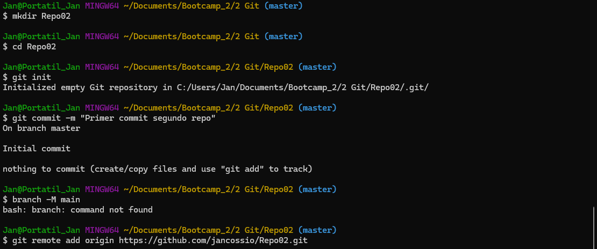
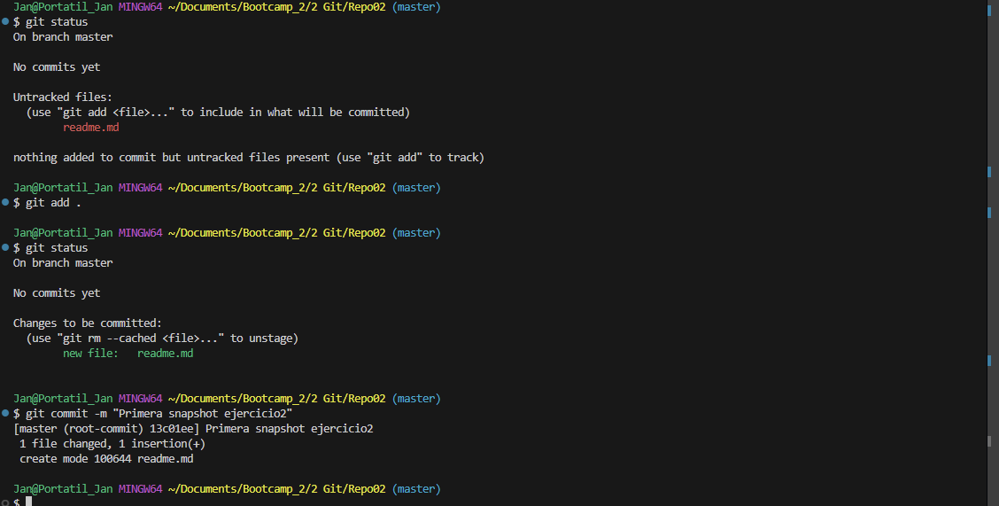
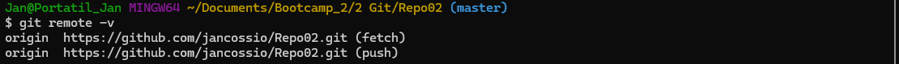
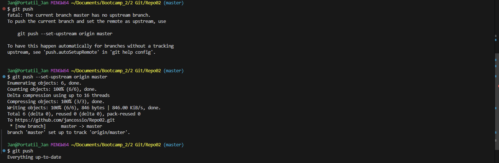

## Creación del repositorio Repo02

#### Todos los comandos utilizados hasta el momento:

- __[git init](https://git-scm.com/docs/git-init)__ - Crea un nuevo repositorio local de Git en el espacio indicado,(o reinicia uno ya existente).

- __[git status](https://git-scm.com/docs/git-status)__ - Muestra el estado de los ficheros del repositorio en el que se está trabajando. Es decir, permite ver los cambios realizados que se han preparado en el área de staging, y los que no.

- __[git commit](https://git-scm.com/docs/git-commit)__ - Este comando se ejecuta para pasar los contenidos del área de staging al repositorio local.

- __[ait add](https://git-scm.com/docs/git-add)__ - Agrega los ficheros o contenidos que se hayan modificados al área de staging del repositorio.

- __[git remote](https://git-scm.com/docs/git-remote)__ - Administra el set del repositorio remoto que está unido con el repositorio local.

- __[git remote -v](https://git-scm.com/docs/git-remote)__ - Lista los diferentes ficheros y archivos del repositorio remoto asociados a tu repositorio local.
- __[git remote add origin [URL]](https://docs.github.com/en/get-started/getting-started-with-git/managing-remote-repositories)__ - Este comando se utiliza para establecer un repositorio remoto desde el repositorio local.

- __[git push](https://git-scm.com/docs/git-push)__ - Este comando permite subir los cambios realizados en un repositorio local a uno remoto.
- __[git push --set-upstream origin [branch]](https://gist.github.com/davidportella/5749283)__ - Ordena a un repositorio remoto que cree una rama para asociarla a su respectiva rama local, junto con su historial de commits.

